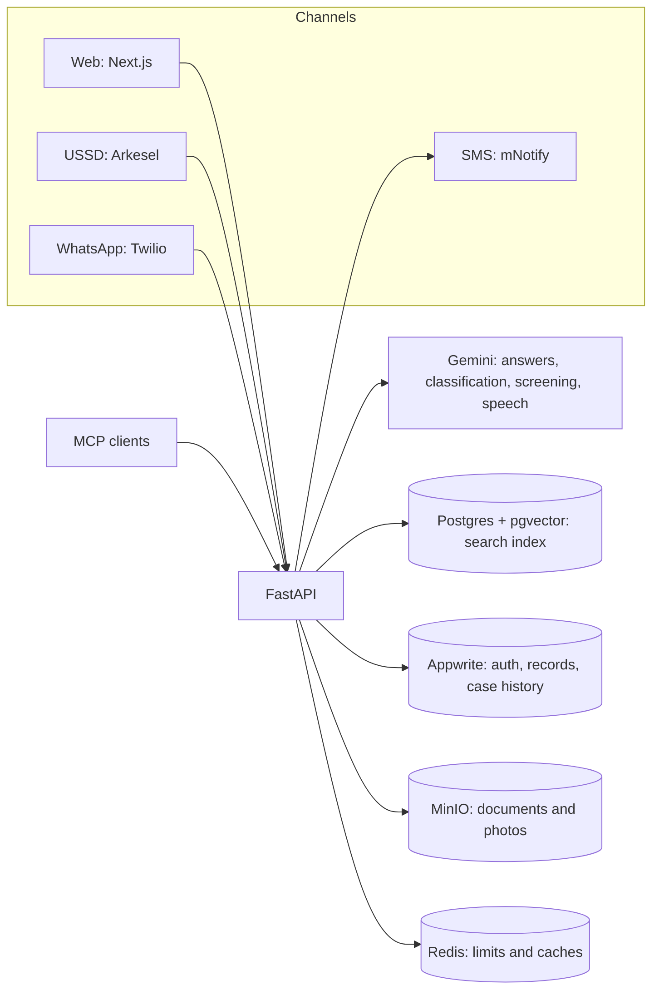

# Nokware

**The Accra Metropolitan Assembly, answerable.**

Ask the Assembly's own documents and get a cited answer. Report a problem or a safety threat, see the work being done, track its progress, and escalate it until you get an answer. Demand what was never published. On any phone.

- **Live site:** https://nokware.tstitagency.com
- **API:** https://api.nokware.tstitagency.com
- **Demo video:** [link](LINK)

Built for the OSF × Andela hackathon *Information You Can Trust*.

## Tracks

| Track | How Nokware serves it |
|---|---|
| **Transparency & Accountability** (primary) | Cited answers from the Assembly's documents, a public record of what should have been published and what was, department response times, and petitions with a public response clock. |
| **Safety, Reporting & Protection** | A private reporting path for threats and abuse, routed only to the Police and Social Welfare, never counted publicly, neutral in every message, with emergency numbers first. |

## The problem

Ghana's 261 metropolitan, municipal and district assemblies are the government closest to people: drains, refuse, local roads, markets, permits and sanitation. The law requires them to publish budgets, fee-fixing resolutions and plans, and to answer requests for information. In practice those documents are PDFs written for auditors, departments are invisible from outside, and a complaint made in person leaves no trace. When something goes wrong, from a blocked drain to a threat at home, people don't know who to call or whether anyone is listening.

Of the 61 documents the Accra Metropolitan Assembly should have published since 2021, 14 are publicly held.

## What a District Assembly is

**Who runs it.** A Chief Executive (for Accra, the Metropolitan Chief Executive, or MCE), nominated by the President and approved by the assembly; assembly members, most elected from electoral areas; and departments staffed by the Local Government Service, who do the day-to-day work.

**What it's responsible for** under the Local Governance Act, 2016 (Act 936): planning and development control; drains, local roads, markets, streetlights and public toilets; sanitation and waste; local revenue from rates, fees and permits; local health, education and social welfare; and disaster prevention and public safety.

**What it must make public:** an annual composite budget, an annual fee-fixing resolution, development plans and action plans, financial reports and audited accounts, and information on request under the Right to Information Act, 2019 (Act 989).

Nokware models Accra's 19 departments, plus Police and Fire Service liaison, and measures the Assembly against these duties using its own published documents.

## What it does

| | |
|---|---|
| **Ask** | Plain-language questions answered only from the Assembly's published documents, with a citation on every figure. Answers can be played aloud. |
| **Report** | Civic problems and safety threats on the web, WhatsApp or USSD. AI reads each report in the background and routes it to the right department, or privately to the Police and Social Welfare. |
| **Follow** | Every step is on the record: routed, started, reassigned with a reason, resolved with a note, escalated, answered. Updates arrive by SMS and WhatsApp, and a case can be checked any time with its reference. |
| **Escalate** | A resident not satisfied with a resolution escalates within 14 days, with photos, and the MCE answers on the record. |
| **Petition** | Demand a missing document, an unanswered question or an action. Phone-verified signatures; at a threshold the MCE must respond on a public clock. |
| **Hold to account** | What the Assembly is required to publish against what exists, and how fast each department responds. |
| **Get help fast** | Emergency and department numbers in one place, each labelled with how well its source is verified. |

## Report anything, safely, from any phone

- **Civic problems:** blocked drains, uncollected refuse, broken streetlights, road damage and market issues, with photos.
- **Safety and abuse:** a separate private form for threats, violence or abuse, with a quick-exit button and helpline numbers on the page, routed only to the Police and Social Welfare.
- **Any channel:** the web, WhatsApp (text or voice note), or USSD on any phone with no data. Nokware works for people without smartphones or data.
- **Emergency numbers first:** the USSD menu opens with the numbers to call now, and the site lists emergency and department contacts in one place. Nokware says plainly that it cannot send help itself.

**How a report moves:** the resident reports → AI classifies its type, severity and sensitivity (a place outside the Assembly is refused first) → it's routed to one of 19 departments, or privately to the Police and Social Welfare → the department works it on the record (departments are named, officers never) → the resident is updated by SMS and WhatsApp at each step and can escalate if not satisfied.

## A workspace for every department

Each department, the Police and Fire Service liaison, and the MCE has its own portal.

- **One queue per department.** Cases arrive already routed.
- **Manage the caseload.** Filter and sort by status, open each case with its photos, then acknowledge, start, reassign with a reason, or resolve with a note.
- **Everything on the record.** Every action is timed and recorded, so a department can show its work and a case can't quietly disappear.
- **Oversight from the MCE.** The MCE sees every department, answers escalations, responds to petitions, and can ask a department to answer one.

## Independent oversight

No one marks their own work. Departments work the cases routed to them. The MCE oversees departments and answers escalations and petitions. Verified contributors referee public content. The admin runs the platform.

- **Verified contributors** are independent of the Assembly: journalists, researchers and civil society members, verified before they're given the role. They add the Assembly's published documents to the Ledger and act as referee on petitions, comments and images.
- **Why they're needed.** If the Assembly moderated petitions about itself, it could quietly remove criticism. Contributors can remove content only on four fixed grounds (naming a private person, inciting violence, personal data, or a duplicate), and never a petition they created or signed. Every removal is public, with its reason, where the content was.
- **The admin** runs the platform (accounts, roles and department teams) and is separate from both the Assembly and the contributors.
- **Every action by every role is recorded.**

## Built for everyone

- **Hear every answer.** Any answer can be played aloud, for people who are visually impaired, who find reading hard, or who prefer to listen. The audio starts preparing as soon as you reach the button.
- **Speak instead of typing.** Send a voice note on WhatsApp and Nokware understands it.
- **Usable by everyone.** Plain language, one clear set of status labels, screen-reader labels, full keyboard use, and colour contrast that meets WCAG AA.
- **Low bandwidth.** Works on slow connections, and on basic phones through USSD with no data.

## How it meets the brief

| Constraint | How Nokware meets it |
|---|---|
| Trust and verification | Citations on every claim, invented citations removed, budget figures verified against extracted source rows, publisher and date on every document, gaps published as findings. |
| Low bandwidth | Full service over USSD on any phone with no data, plus SMS and WhatsApp. Photos are shrunk in the browser before upload. |
| Accessibility | Answers read aloud, WhatsApp voice notes understood, plain language, screen-reader labels, keyboard use, WCAG AA contrast. |
| Privacy and security | Safety reports excluded from every public count, counts of 1 to 4 shown as "fewer than 5", location minimised, contact details deleted 30 days after a case closes, GPS removed from photos, content naming a private person refused. |
| Multilingual | Ask understands and answers in English, French and Twi; English and French answers are read aloud. Screens and channel messages are in English today (see [Languages](#languages)). |
| Local relevance | One real assembly: its 19 departments, sub-metros, fees, budgets and publishing duties. All of it is data, so another assembly is configuration. |
| Clear next steps | Every answer ends in an action: the department, the case reference, the emergency number, escalation, or the Right to Information route. |

## Trust and accuracy

- Answers come only from retrieved passages. Every figure carries a citation: `[S#]` a document passage, `[R#]` a live count from Nokware's records, `[B#]` a verified budget figure. Any other label is removed before the answer is shown.
- Budget figures are checked against the extracted source rows, not taken from the model's reading.
- When the Ledger doesn't hold something, Nokware says so and offers the nearest figures it does hold. When sources disagree, it says that.
- Charts are drawn only from verifiable figures, and explain why when they can't be.
- Every document shows its publisher and date.
- What is missing is published as a finding, and where nothing is published, Ask points to the Right to Information route with the real contact.

## Try it

No account is needed to ask, report, follow a case, or sign a petition.

- **Web:** https://nokware.tstitagency.com
- **WhatsApp (Twilio sandbox):** send `join somehow-firm` to +1 415 523 8886, then ask a question or report a problem.
- **USSD:** runs on Arkesel's shared test extension. Menu: 1 Emergency numbers, 2 Ask, 3 Report, 4 Check a case, 5 Confirm a web code, 6 Sign a petition, 7 Check a petition.

Questions that show it well: *What is AMA's approved budget for 2026?* · *How much did AMA budget for roads in 2026 compared with 2022?* · *What was AMA Expenses between 2023 and 2026?*

### Roles

| Role | What they do |
|---|---|
| Resident | Ask, report, follow, escalate, petition, sign, comment. No account. |
| Department (19) | Receive routed cases; acknowledge, start, reassign with a reason, resolve with a note; answer petitions the MCE shares. |
| Police and Fire liaison | Receive safety and emergency cases. |
| MCE | Oversee every department, answer escalations, respond to petitions, share them with departments. |
| Verified contributor | Independent of the Assembly. Adds documents to the Ledger; referees petitions, comments and images on four fixed grounds. |
| Admin | Runs the platform: accounts, roles and department teams. |

Demo portal logins are provided in the submission form.

## Architecture

- **Answers.** Questions are expanded, then searched by meaning (pgvector, HNSW) and by keyword at once, and the results merged. Gemini writes from the retrieved passages only, and every citation is checked against what was retrieved.
- **Background routing.** A model reads every report and classifies its type, severity and sensitivity; a routing table assigns the department.
- **Screening.** Petitions, comments and staff notes are checked for personal data and for naming a private person, and refused with the reason.
- **Voice.** Speech to text for questions and WhatsApp voice notes; text to speech for answers.
- **MCP.** A read-only endpoint at `/mcp` gives AI assistants the same public data under the same rules, with no extra access.

**Stack:** Next.js 16 (App Router, TypeScript, Tailwind, shadcn/ui) · FastAPI (Python 3.11) · Gemini · Postgres with pgvector · Appwrite · MinIO · Redis · Arkesel USSD · mNotify SMS · Twilio WhatsApp · Docker on a self-hosted VPS via Coolify.

## Information sources

- **The Assembly's published documents**, from its official website: 164 documents, including budgets, fee-fixing resolutions, plans and press releases, split into about 7,500 searchable passages.
- **The 2022 revised and 2026 approved budgets:** 290 budget lines extracted, covering 93.3% of the 2022 stated total and 96.4% of the 2026 total. A block of the document is kept only where its rows add up to the fund-source total the document itself states: 98 of 100 blocks in 2022, 84 of 86 in 2026.
- **Statutory publishing duties** for assemblies, under the Local Governance Act, 2016 and the Right to Information Act, 2019, used to build the publishing record.
- **Published emergency and department contacts**, each with a source tier.
- **Published safety statistics**, which show public DOVVSU figures stopping in 2018.

## How it was built

I designed and built Nokware as a solo engineer, architecting the system, its rules and its safeguards, and used Claude Code to help implement the code and logic. 857 backend and 159 frontend tests, plus checks in a real browser. Performance was measured before it was tuned: the read-aloud delay went from about 16 seconds to 8. Limitations are listed below rather than hidden.

## Scale

Ghana has 261 assemblies with the same legal duties. Departments, routing, phrases, contacts and statutory rules are data files, so another assembly is configuration, not a rebuild. Channel providers are swappable, and languages are phrase files. It runs on one modest server; answers are cached and SMS is capped per person and per day.

**Next:** a pilot with one assembly and a dedicated USSD short code; a verified WhatsApp sender; Twi read aloud, with reviewed Twi, Ga and Ewe safety wording; voice notes on petitions; then neighbouring Accra assemblies and other regions.

## Run it locally

This is a monorepo:

- `backend/`: Python 3.11, FastAPI, LangChain, Gemini, Appwrite SDK, MinIO, pgvector. Setup in [backend/README.md](backend/README.md).
- `frontend/`: Next.js 16 with shadcn/ui. Setup in [frontend/README.md](frontend/README.md).

Deployment is described in [docs/DEPLOYMENT.md](docs/DEPLOYMENT.md).

## Languages

**Today.** Ask on the web answers in the language it was asked in, including French and Twi. The question is read into English, the answer is written and checked in English, then translated back, and it falls back to English if a figure or citation doesn't survive the translation. English and French answers can be read aloud; Twi answers are written, and read-aloud for Twi is next. The site's screens and the WhatsApp, USSD and SMS messages are in English. Fixed text comes from a hand-written catalogue (`backend/app/data/phrases/`), and text someone may act on while in danger stays in English until a named person has reviewed the translation.

**Next.** The catalogue exists so that adding a language is a file, not a rebuild.

- A language switcher on the site. The site's text lives in its components, not yet in the catalogue; moving about a thousand strings is most of the work.
- Languages on WhatsApp, following the language a person writes in and remembering it for their number.
- A language screen on USSD, and SMS updates in the report's language. French first, with every screen within 160 characters and accented letters written plainly for feature phones.
- Twi screens, once a speaker has written them. Machine Twi drops ɛ and ɔ, mixes dialects and can lose a negative, so Nokware won't draft the catalogue itself.
- Arabic, on the site and WhatsApp only. Arabic can't go on USSD or SMS: one Arabic character halves an SMS to 70 characters, many feature phones have no Arabic font, and the direction marks that keep a phone number in order show as boxes on old handsets. A reordered emergency number is dangerous.

## Petitions

A petition is public the moment its creator publishes it. Nobody in the Assembly approves it first: the office a petition is usually about cannot decide whether it exists.

A verified contributor is the referee instead: not Assembly staff, with no stake in the outcome. A contributor may remove a petition only on four fixed grounds: it names or attacks a private individual, incites violence, carries personal data, or duplicates an open petition (citing the other petition's number). Never their own petition, and never one they signed. "Not the Assembly's responsibility" is a judgement on the merits and belongs in the MCE's response, not in a removal.

A removal is public and anonymous: the ground, the date, and "Removed by a verified contributor". The identity stays in the audit trail. What replaces the petition is built from the removal record, so it cannot leak the title, text, images, comments, signature count or the MCE's response.

Any reader can report a petition on the same grounds. A report hides nothing; it joins the contributor's queue. Removals are counted publicly by ground, so a contributor removing too freely becomes visible.

The creator can edit and republish at any time, including after a removal. Each edit is a public version; signatures carry over, each remembering the version it was given on, and the removal count is shown.

The MCE responds to a petition that reaches its threshold within 30 days, or shares it with a department, which can add one note shown publicly under its name. The petitioner can reply. Comments are open to anyone who can sign, under a display name and never a phone number, screened like everything else and removable one at a time.

## Roadmap

- **Voice notes on petitions.** The voice path exists for reports and Ask; petitions need the same transcription and the same labelling of machine transcripts.
- **Restoring a removal without republishing.** Undoing a removal, with the undo itself public.
- **Language switchers** on the site, WhatsApp and USSD (see Languages).
- **Department-initiated escalation.** Today only the resident escalates. A department sending a case upward needs a new action on the case state machine, its own history entry and message, and rules for who may do it and when.
- **A fixed vocabulary for resolution notes**, alongside free text, so resolutions are comparable across departments.

## Known limitations

- **Reading aloud starts after about 7 seconds.** The speech model takes about 0.7 seconds per second of audio. Hovering Listen starts it early, so a press usually plays at once; streaming synthesis would fix it properly.
- **Message repair has two gaps.** A message stuck at "queued" after a crash can be settled but never confirmed, and messages recorded while `SMS_PROVIDER=log` are not backfilled when a real provider is set.
- **Escalation photos and comments are web only.** USSD and WhatsApp point to the page.
- **Moderation depends on active contributors.** Nothing hides a petition automatically; that is the trade for an institution not deciding what may be said about it.
- **SMS verification codes are off by default** (`SMS_VERIFICATION_CODES`) until a live sender ID; phones are confirmed over WhatsApp or USSD.
- **The WhatsApp number is Twilio's sandbox**, and USSD runs on a shared test extension. Production needs a verified WhatsApp sender and a dedicated short code.
- **No screen-reader test with a real user yet**, and the report form's photo field has a duplicate tab stop (see `frontend/README.md`).

## Future work: structure

The code was cleaned up before submission without restructuring. Improvements that would move responsibilities between modules:

- Shared SMS plumbing: `services/sms_bms.py` imports private helpers from `services/sms.py`; `services/petition_updates.py` repeats the delivery step of `services/notifications.py`.
- One cache: `report_dashboard._Cache` is imported privately by `publishing_record` and `department_responsiveness`, and `stats` has its own.
- Answer types defined once: `services/rag.py` builds TypedDicts that `schemas/ask.py` defines again as models.
- Schema scripts: `scripts/create_citizen_reports.py` is both a script and a helper library; its helpers are rewritten in `create_document_history.py` and `add_document_origin.py`.
- Repeated small helpers: Redis daily counters, key derivation from the Appwrite secret (purpose strings must stay byte-identical), GH¢ parsing in four places, three sets of Markdown-stripping patterns.
- Contact wording in one place: `contacts.short_line` and `channel_contacts` label the same numbers differently.
- `services/report_followups.py` handles both resident actions and the contact purge.
- The frontend repeats rules the API owns: petition durations, form limits and the emergency numbers on the report pages.
- Seven frontend dialogs rewrite handling that `cases/case-dialog.tsx` already provides as a hook.
- `frontend/src/lib/petitions.ts` mixes wording with browser storage; `lib/report/dashboard.ts` mixes date formatting with the "fewer than 5" rules.

---

**Every answer shows its source. Every gap is on the record.**
